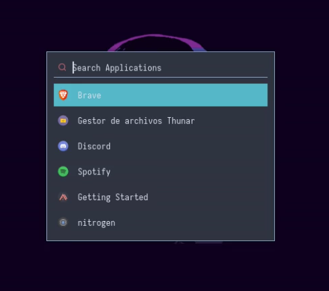

# Preview

</img>

-----------------------------------------

<h5>Notificaction daemon</h5>

Dunst

</img>

-----------------------------------------

<h5>Statusbar</h5>

Polybar

</img>

-----------------------------------------

<h5>App Launcher</h5>

Rofi

</img>

-----------------------------------------

<h5>Terminal Emulator</h5>

Kitty

</img>

-----------------------------------------

<h5>Wallpaper</h5>

Just a wallpaper

</img>

# Dependencies

- Bspwm  
- Sxhkd  
- Polybar  
- Rofi  
- Kitty  
- Zsh  
- Oh-my-zsh!  
- Dunst  
- Xfce4-power-manager

