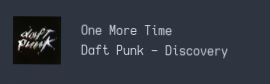
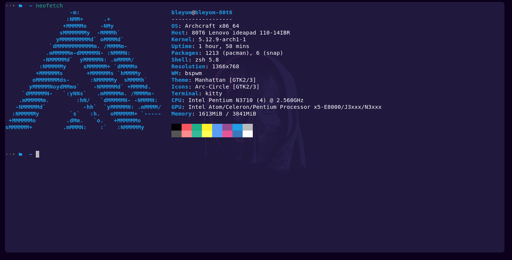
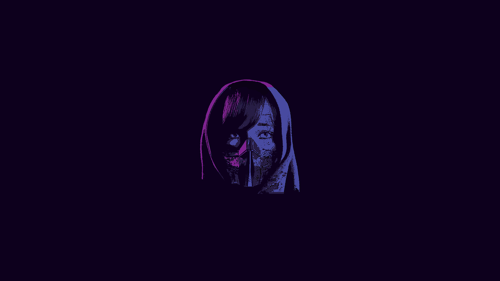

# Preview

</img>

-----------------------------------------

<h5>Notificaction daemon</h5>

Dunst

</img>

-----------------------------------------

<h5>Statusbar</h5>

Polybar

</img>

-----------------------------------------

<h5>App Launcher</h5>

Rofi

</img>

-----------------------------------------

<h5>Terminal Emulator</h5>

Kitty

</img>

-----------------------------------------

<h5>Wallpaper</h5>

Just a wallpaper

</img>

# Dependencies

- bspwm  
- sxhkd  
- polybar  
- rofi  
- kity  
- zsh  
- oh my zsh!  
- dunst  
- xfce4-power-manager

